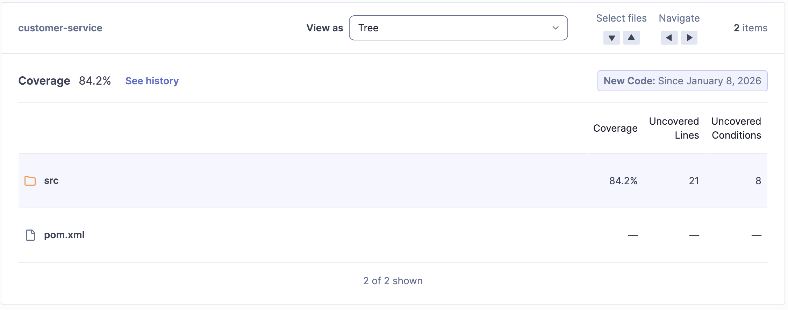

# SOAT Customer Microservice (customer-service)

Microsserviço responsável pelo gerenciamento de clientes da rede de Fast Food. Este serviço permite o cadastro de novos clientes e a identificação via CPF, sendo fundamental para o fluxo de pedidos e identificação no totem de autoatendimento.

## Sobre o Projeto

Este projeto foi desenvolvido utilizando **Java 21** e **Spring Boot 3**, seguindo os princípios da **Clean Architecture** (Arquitetura Limpa) para garantir o desacoplamento entre as regras de negócio (Domain), casos de uso (Application) e implementações de infraestrutura.

### Funcionalidades

* **Cadastro de Clientes:** Criação de novos clientes com validação de regras de negócio (CPF único, formato de e-mail, etc.).
* **Identificação:** Busca de clientes através do CPF.
* **Persistência Relacional:** Armazenamento seguro utilizando PostgreSQL.
* **Migração de Dados:** Controle de versão do banco de dados via Flyway.
* **Health Check:** Endpoint para verificação de saúde da aplicação e prontidão do Kubernetes.

## Tecnologias Utilizadas

* **Linguagem:** Java 21
* **Framework Web:** Spring Boot 3.4.5
* **Banco de Dados:** PostgreSQL 17
* **Migração de Dados:** Flyway
* **Documentação:** OpenAPI (Swagger UI)
* **Containerização:** Docker
* **Orquestração:** Kubernetes (EKS)
* **CI/CD:** GitHub Actions
* **Qualidade de Código:** SonarQube, Jacoco
* **Testes:** JUnit 5, Mockito, Testcontainers

## Políticas de Branch e Segurança

Para garantir a qualidade e a estabilidade do ambiente produtivo, o repositório segue regras rígidas de proteção:

* **Bloqueio de Commits na Main:** Não é permitido realizar commits diretamente na branch `main`. Alterações devem vir de branches auxiliares.
* **Obrigatoriedade de Pull Requests (PR):** Merges para a `main` só podem ser realizados através de Pull Requests revisados.
* **Verificação de Status (CI):** O merge só é habilitado se a esteira de Integração Contínua (CI) for executada com sucesso, garantindo que todos os testes passaram e o Quality Gate do SonarQube foi atingido.

## Configuração Local

### Pré-requisitos

* Docker e Docker Compose
* Java 21 (Opcional, para execução fora do container)
* Maven (wrapper `./mvnw` incluso no projeto)

### Instalação e Execução

A maneira mais simples de rodar a aplicação localmente, incluindo o banco de dados PostgreSQL, é via Docker Compose.

1.  **Subir a aplicação e o banco de dados:**

``bash
docker-compose up --build
``

2.  **Acessar a API:**
    * A API estará disponível em: `http://localhost:8080`
    * **Documentação Swagger:** `http://localhost:8080/docs`
    * **Spec OpenAPI:** `http://localhost:8080/v3/api-docs`

3.  **Limpar o ambiente:**

``bash
docker-compose down
``

## Endpoints da API

A documentação completa pode ser visualizada no Swagger, mas os principais endpoints são:

* **POST** `/customers`: Cria um novo cliente.
    * *Payload:* Nome, CPF, E-mail e Telefone.
* **GET** `/customers?cpf={cpf}`: Busca os dados de um cliente pelo CPF.

## Testes

O projeto conta com testes unitários e de integração (usando Testcontainers para o banco de dados) para validar as regras de domínio e persistência.

**Executar testes via terminal:**

``bash
./mvnw test
``

## Cobertura de Testes

A qualidade do código é monitorada continuamente pelo **SonarQube**. O pipeline de CI/CD exige um mínimo de cobertura para aprovar alterações.

**Evidência de Cobertura:**

> A imagem acima demonstra as métricas de cobertura de código e confiabilidade extraídas da última análise.

## Pipeline CI/CD

O fluxo de automação está definido em `.github/workflows/ci.yml` e contempla:

1.  **Docker Build:** Constrói a imagem da aplicação.
2.  **Unit Test:** Executa os testes automatizados dentro do container, gerando o relatório de cobertura Jacoco.
3.  **Package:** Empacota a aplicação (`mvn package`).
4.  **Deploy:**
    * Autentica na AWS e no Amazon ECR.
    * Realiza o push da imagem Docker.
    * Atualiza o contexto do Kubernetes (EKS).
    * Aplica os manifestos de infraestrutura (`kubectl apply`) usando `envsubst` para injetar variáveis de ambiente sensíveis.

## Recursos Kubernetes

Os manifestos de infraestrutura estão localizados na pasta `infra/`:

* **Namespace:** Criação do namespace `customer-service`.
* **ConfigMap:** Variáveis de ambiente como URL do banco de dados.
* **Secrets:** Credenciais sensíveis (usuário e senha do banco).
* **Deployment:** Gerencia as réplicas da aplicação (Backend).
* **Service:** Expõe a aplicação via LoadBalancer.
* **HPA:** Horizontal Pod Autoscaler para escalar os pods baseado no uso de CPU (target 75%).
